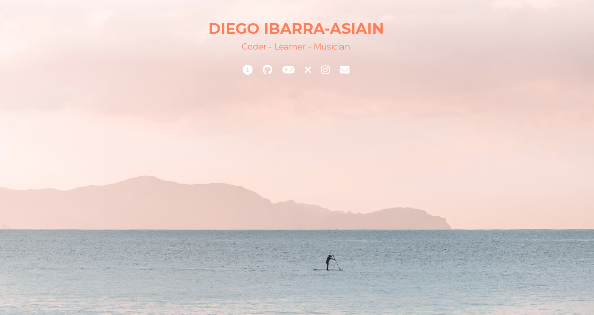

# Diego Ibarra-Asiain's Personal Website

## Table of Contents

- [Description](#description)
- [Links](#links)
- [About Me](#about-me)

## Description

This is my personal website where I showcase my journey from being a professional musician to entering the world of coding. The site includes information about me, links to my projects, and social media profiles.

## Links

- [GitHub Repository](https://github.com/your-github-repo) for the code of this website.
- [Blackjack Game](https://eldiegoibarra.github.io/Blackjack/): My first coding project.
- [Twitter](https://twitter.com/your-twitter-handle): Follow me on Twitter.
- [Instagram](https://www.instagram.com/your-instagram-handle/): Check out my Instagram.
- Email: [infodiegoibarra@gmail.com](mailto:infodiegoibarra@gmail.com)

## About Me

I'm Diego, a professional musician with over a decade of experience as a session bass player. However, I've embarked on a new journey into the world of coding. My fascination with coding began when I was 14, creating simple websites related to my passions, like football, the NBA, and music. Now, at 35, I'm blending the familiar with the uncharted as I explore coding. I initially tried joining government-backed bootcamps, but with zero coding knowledge, I decided to take matters into my own hands. With determination, I turned to self-learning through resources like YouTube, FreeCodeCamp, and Scrimba. Gradually, I began to understand the intricacies of coding. Though I had attempted to join Founders and Coders (FAC) in the past without success, my continued learning journey has prepared me for this next step. FAC, recognized as one of the top programs in the UK, welcomed me into an environment filled with people ready to learn and help. As I move forward, I'm enthusiastic about embracing the vast opportunities in web development, determined to make a meaningful contribution to this dynamic field while aspiring to combine my passion for music with programming in the future.

This personal website reflects (and it'll continue doing it) my transition from the world of music to the world of coding. Feel free to explore and connect with me through the links above.
